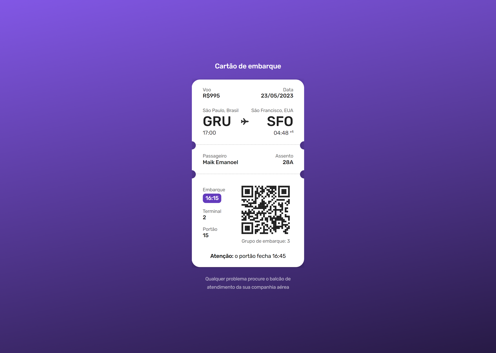

<h1 align="center"> Cartão de Embarque - BoraCodar#6 </h1>

[Clique aqui para acessar](https://maik-emanoel.github.io/boarding-pass/)

## 🚀 Tecnologias

Esse projeto foi desenvolvido com as seguintes tecnologias:

- HTML
- CSS
- Figma

## 💻 Projeto

Um cartão de embarque online que mostra todas as informações do voo para o usuário.  

Obs: Projeto construído a partir do layout proposto no desafio [#BoraCodar](https://boracodar.dev/) realizado pela [Rocketseat](https://rocketseat.com.br).